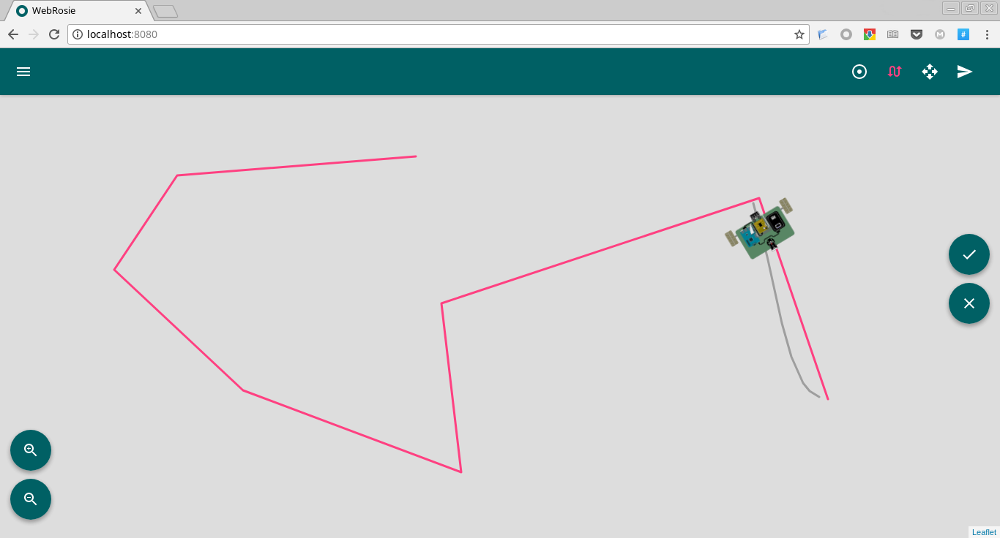
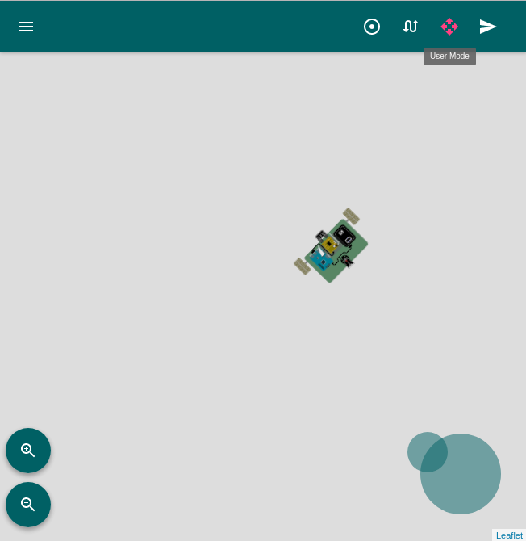

# WebRosie

Front-end for the [rosie](https://github.com/PyForce/rosie) module.

This application represents the visual interaction with the [rosie](https://github.com/PyForce/rosie) module. It provides a way of controlling multiple rosie running robots in a user friendly way.

## Features

- Simple user interface

    The user interface is designed to be simple, full featured and easily extensible, it uses [React](https://facebook.github.io/react/), [Material-UI](http://www.material-ui.com/) and [Redux](https://github.com/reactjs/redux.git) to achieve this funtionality.

    

- Touch support

    The page uses [nipplejs](https://github.com/yoannmoinet/nipplejs.git) to provide user control over the robot in touch devices.

    

- Single packaged binary

    The server of the application is implemented in [Go](https://golang.org), so you just need to run a single binary file.

## Build

This application uses go to serve the static files and also to autodiscover [rosie](https://github.com/PyForce/rosie). All the files needed can be packaged into a single binary file. In order to build the server run:

```
$ npm run build
```

This runs webpack with the production configuration (`webpack.config.prod.js`), which creates all the static files, and then builds the go application.

Alternatively, you can build a development version, this doesn't package the static files, instead, it loads them from disk:

```
$ npm run build:dev
```

## Running tests

To run the tests, use the following command. It runs the Mocha
test-suite for the JavaScript app.

```
$ npm run test
```

You can also run the JavaScript tests in watch mode by passing an additional
flag into the npm `run-script` command.

```
$ npm run test -- -w
```

This enables that TDD sweetness, allowing you to focus on feeding the
red-to-green beast.


